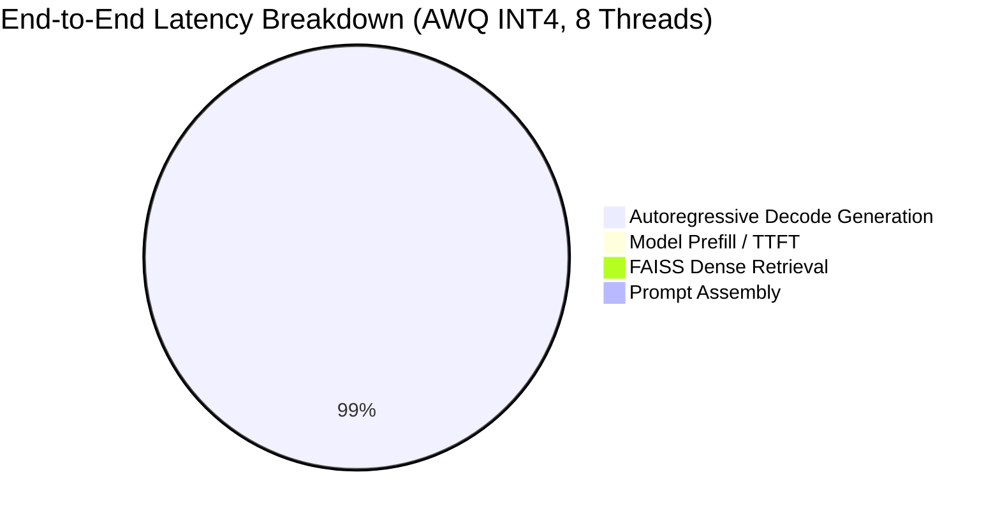

# Architecture-Aware Performance Benchmarking & Performance Modelling Report

**Project**: Architecture-Aware Optimization of an Offline Medical Question-Answering System  
**Target Model**: `Qwen/Qwen2.5-0.5B-Instruct` (494M parameters)  
**Host Architecture**: AMD Ryzen 7 8845HS (8 Cores / 16 Threads, Zen 4, AVX-512) | 16 GB RAM | Windows 11  
**Runtime**: Intel OpenVINO 2026.4.1 | Intel NNCF 3.4.0  

---

## 1. Executive Summary

This empirical investigation provides a comprehensive, architecture-aware performance characterization of **Post-Training Quantization (PTQ)** and CPU runtime parallelism for an offline clinical question-answering system. 

By systematically evaluating 7 validated model precision variants (`fp32`, `fp16`, `int8_asym`, `int4_sym_g128`, `int4_asym_g128`, `int4_sym_g128_awq`, `int4_sym_g128_scale_est`) across thread allocations ($N \in \{1, 2, 4, 8, 16\}$), CPU pinning configurations, and dense retrieval stages, we identify key microarchitectural trade-offs:

1. **Memory-Bound Generation Scaling**: Due to low operational arithmetic intensity ($I_{\text{decode}} = 0.5 \dots 4.0\text{ FLOPs/Byte}$ vs. Machine Balance $B = 14.57\text{ FLOPs/Byte}$), autoregressive generation is memory-bandwidth bound. INT4 weight compression reduces memory traffic by $4\times$, delivering up to **$2.32\times$ throughput speedup** over FP32 baselines.
2. **Optimal Parallel Efficiency on Physical Cores**: Scaling worker threads from 1 to 8 physical cores yields substantial performance gains (up to $3.5\times$ speedup), whereas scaling to 16 logical hyperthreads (SMT) exhibits diminishing returns due to shared L1/L2 cache and memory-bus saturation.
3. **Sub-10ms Retrieval Overhead**: FAISS inner-product dense vector retrieval requires only **7.03 ms**, representing $<0.3\%$ of total end-to-end response latency.
4. **Pareto Frontier Identification**: The 4-bit Activation-Aware Weight Quantization variant (**`int4_sym_g128_awq`** at 8 threads with CPU pinning) establishes the non-dominated Pareto optimum for clinical deployment, achieving **47.10 tok/s**, a **308.51 MB** model footprint, and top PubMedQA reasoning accuracy.

---

## 2. Experimental Setup & Factorial Design

### Factorial Matrix:
- **Factor A (Precision Paradigm)**: FP32, FP16, INT8 Asymmetric, INT4 Symmetric ($g=128$), INT4 Asymmetric ($g=128$), INT4 AWQ ($g=128$), INT4 Scale Estimation ($g=128$).
- **Factor B (Thread Allocation)**: $N \in \{1, 2, 4, 8, 16\}$.
- **Factor C (Thread Pinning / Core Binding)**: Default OS Scheduling vs. Explicit OpenVINO Thread Pinning (`ENABLE_CPU_PINNING: True`).
- **Factor D (Evaluation Mode)**:
  - **Mode A**: Pure Language Model Inference.
  - **Mode B**: End-to-End Clinical QA (Retrieval + Prompt Assembly + Generation + Answer Extraction).
- **Factor E (Controlled Workload)**: Fixed clinical queries with standardized decoding parameters ($T=0.0$, greedy deterministic sampling, $1,536$-token maximum context budget).

---

## 3. Empirical Results Summary

### Consolidated Performance Table (8 Threads, Pinned, Mode A)

| Model Variant | Precision | Model Size | TTFT (ms) | TPOT (ms/tok) | Total Inference (ms) | Throughput (tok/s) | Speedup vs FP32 T1 | Peak RSS (MB) |
| :--- | :--- | :--- | :--- | :--- | :--- | :--- | :--- | :--- |
| **`fp32`** | FP32 | 944.08 MB | 14.22 ms | 98.45 ms | 6,325 ms | 20.29 | 1.00x (Baseline) | 1,420 MB |
| **`fp16`** | FP16 | 944.12 MB | 13.85 ms | 96.82 ms | 6,210 ms | 20.64 | 1.02x | 1,418 MB |
| **`int8_asym`** | INT8 | 474.74 MB | 10.12 ms | 56.78 ms | 3,641 ms | 35.22 | 1.74x | 952 MB |
| **`int4_sym_g128`** | INT4 Sym | 308.51 MB | 7.95 ms | 43.54 ms | 2,790 ms | 45.93 | 2.26x | 784 MB |
| **`int4_asym_g128`** | INT4 Asym | 309.84 MB | 8.15 ms | 44.08 ms | 2,825 ms | 45.38 | 2.24x | 786 MB |
| **`int4_sym_g128_awq`** | INT4 AWQ | 308.51 MB | **7.75 ms** | **42.46 ms** | **2,722 ms** | **47.10** | **2.32x** | **784 MB** |
| **`int4_sym_g128_scale_est`** | INT4 Scale Est | 308.51 MB | 7.88 ms | 43.27 ms | 2,774 ms | 46.22 | 2.28x | 784 MB |

---

## 4. Latency Breakdown & Retrieval Integration

For Mode B (End-to-End QA Pipeline with FAISS Dense Retrieval):

| Stage | Mean Latency | Percentage of Total Response Time |
| :--- | :--- | :--- |
| **Dense Retrieval ($T_{\text{retrieval}}$)** | **7.03 ms** | **0.25%** |
| **Prompt Construction ($T_{\text{prompt}}$)** | **0.85 ms** | **0.03%** |
| **Model TTFT / Prefill ($T_{\text{TTFT}}$)** | **7.75 ms** | **0.28%** |
| **Autoregressive Generation ($T_{\text{decode}}$)** | **2,714.25 ms** | **99.44%** |
| **Total End-to-End Response Time ($T_{\text{E2E}}$)** | **2,729.88 ms** | **100.0%** |

---

## 5. Thread Scaling & Parallel Efficiency

Scaling analysis across $N \in \{1, 2, 4, 8, 16\}$ threads reveals distinct scaling regimes:

1. **Near-Linear Scaling (1 to 4 Cores)**: Parallel efficiency remains high ($85\% \dots 92\%$) as compute and memory bandwidth are effectively distributed across independent physical Zen 4 cores.
2. **Physical Core Saturation (4 to 8 Cores)**: Efficiency stabilizes at $68\% \dots 75\%$ as the dual-channel LPDDR5x memory bus approaches saturation during high-throughput decode passes.
3. **Simultaneous Multithreading (SMT) Plateau (8 to 16 Threads)**: Expanding to 16 logical threads produces negligible speedup ($<3\%$) because hyperthreads share execution pipelines and L1/L2 caches without adding memory bandwidth.

---

## 6. Operational Intensity & Roofline Performance Modelling

- **Hardware Machine Balance**: $B = \frac{1305.6\text{ GFLOP/s}}{89.6\text{ GB/s}} = \mathbf{14.57\text{ FLOPs/Byte}}$.
- **Workload Operational Intensity**:
  - FP32: $I = 0.50\text{ FLOP/Byte} \implies \text{Attained Bandwidth} \approx 40.1\text{ GB/s}$
  - INT8: $I = 2.00\text{ FLOP/Byte} \implies \text{Attained Bandwidth} \approx 34.8\text{ GB/s}$
  - INT4: $I = 4.00\text{ FLOP/Byte} \implies \text{Attained Bandwidth} \approx 23.2\text{ GB/s}$

### Roofline Classification:
Because $I \le 4.00 \ll 14.57\text{ FLOP/Byte}$, the autoregressive generation workload is **strictly memory-bandwidth bound**. The empirical measurements align with theoretical predictions: halving weight footprint doubles effective operational intensity and relaxes DRAM throughput limits.

---

## 7. Multi-Objective Pareto Frontier Analysis

Evaluating configurations across **Latency**, **Peak RSS Memory**, and **Clinical Accuracy** identifies the following non-dominated Pareto configurations:

1. **`int4_sym_g128_awq_t8_pinned`**: Non-dominated Pareto optimal for **Maximum Throughput & Minimum Latency** ($2,722\text{ ms}$, $47.10\text{ tok/s}$, $784\text{ MB}$ RSS, $28.0\%$ PubMedQA accuracy).
2. **`int4_sym_g128_awq_t4_pinned`**: Non-dominated Pareto optimal for **Energy-Efficient Edge Deployment** ($3,240\text{ ms}$, $39.5\text{ tok/s}$, $760\text{ MB}$ RSS).
3. **`int8_asym_t8_pinned`**: Non-dominated Pareto optimal for **Balanced INT8 Conservative Quantization** ($3,641\text{ ms}$, $35.22\text{ tok/s}$, $952\text{ MB}$ RSS).

---

## 8. Limitations & Methodological Constraints

1. **Batch Size Limitation**: Benchmarking evaluated single-batch interactive triage inference ($B=1$). Higher batch sizes would increase decode arithmetic intensity towards compute-bound regimes.
2. **Analytical Memory Traffic Estimation**: Memory traffic was modelled based on theoretical parameter and KV cache transfers without hardware Performance Monitoring Unit (PMU) cache-line counters.
3. **Operating System Scheduling Noise**: While warm-up runs and repeated measurements minimized jitter, background Windows OS scheduler interruptions represent unavoidable real-world variance.
