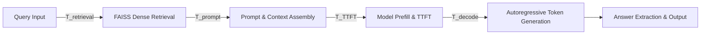

# Latency and Performance Instrumentation Methodology

This document formalizes the mathematical definitions, timer instrumentation, and stage decompositions used to measure execution latency, throughput, and hardware efficiency across model variants and CPU configurations.

---

## 1. Stage Decomposition & End-to-End Pipeline

The offline medical question-answering pipeline decomposes into four mutually exclusive, sequentially ordered stages:

### Mathematical Formulation of Total End-to-End Latency:

$$T_{\text{E2E}} = T_{\text{retrieval}} + T_{\text{prompt}} + T_{\text{TTFT}} + T_{\text{decode}}$$

Where:
1. **$T_{\text{retrieval}}$**: Time elapsed during query tokenization, OpenVINO embedding forward pass, mean pooling, $L2$ vector normalization, FAISS inner-product vector search, and metadata lookup:
   $$T_{\text{retrieval}} = t_{\text{prep}} + t_{\text{embed}} + t_{\text{faiss}} + t_{\text{meta}}$$
2. **$T_{\text{prompt}}$**: Time elapsed assembling ranked context chunks, enforcing the context window token budget ($1,536$ tokens), applying delimiters (`---`), and formatting the ChatML prompt.
3. **$T_{\text{TTFT}}$ (Time to First Token)**: Time elapsed from the submission of the tokenized prompt into the language model until the completion and emission of the very first generated token:
   $$T_{\text{TTFT}} = t_{\text{first\_token}} - t_{\text{inference\_start}}$$
   $T_{\text{TTFT}}$ encompasses the **prefill phase**, where the full prompt sequence is processed in parallel to compute initial key-value (KV) cache entries.
4. **$T_{\text{decode}}$ (Decode Phase Latency)**: Time elapsed generating all subsequent tokens after the first token until the EOS (End-Of-Sequence) token or `max_new_tokens` limit is reached:
   $$T_{\text{decode}} = t_{\text{generation\_end}} - t_{\text{first\_token}}$$

---

## 2. Time Per Output Token (TPOT)

**Time Per Output Token (TPOT)** quantifies the average inter-token generation latency during the sequential autoregressive decode phase:

$$\text{TPOT} = \frac{T_{\text{decode}}}{N_{\text{tokens}} - 1} = \frac{t_{\text{generation\_end}} - t_{\text{first\_token}}}{\max(1, N_{\text{tokens}} - 1)}$$

Where $N_{\text{tokens}}$ is the total number of new tokens generated by the model.

### Generation Throughput:

$$\text{Throughput (tokens/second)} = \frac{N_{\text{tokens}}}{T_{\text{total\_inference\_time}}} = \frac{N_{\text{tokens}}}{(T_{\text{TTFT}} + T_{\text{decode}}) / 1000}$$

---

## 3. Benchmark Operational Modes

To isolate architectural and algorithmic performance drivers, benchmarks are executed under two separate operational modes:

| Mode | Pipeline Scope | Measurement Objectives |
| :--- | :--- | :--- |
| **Mode A: Model-Only Inference** | `Prompt` $\rightarrow$ `OpenVINO LLM` | Evaluates weight precision (FP32, FP16, INT8, INT4), thread scaling ($1 \dots 16$), and CPU pinning on pure neural network compute. |
| **Mode B: End-to-End Offline QA** | `Query` $\rightarrow$ `Retrieval` $\rightarrow$ `Prompt` $\rightarrow$ `LLM` $\rightarrow$ `Answer Extraction` | Measures real-world system latency, including vector similarity lookup, memory allocation overhead, and downstream parsing. |

---

## 4. Multi-Run Statistical Treatment

To eliminate transient operating system noise, thermal throttling artifacts, and dynamic CPU frequency scaling spikes:

1. **Warm-up Filtering**: Every benchmark executes $W$ warm-up iterations (default $W=2$) before recording data. Warm-up measurements are **strictly excluded** from all reported summary statistics.
2. **Repeated Measurements**: Every experiment executes $M$ independent measurement iterations (default $M=5$).
3. **Statistical Metrics Computed**:
   - **Mean ($\mu$)** and **Median ($p_{50}$)**
   - **Standard Deviation ($\sigma$)**
   - **Minimum** and **Maximum**
   - **90th, 95th, and 99th Percentiles ($p_{90}, p_{95}, p_{99}$)**
