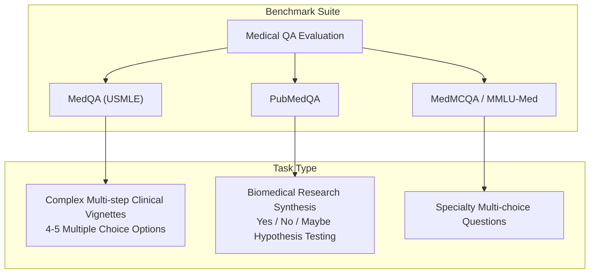

# Medical LLMs, Clinical Benchmarks, and Offline Medical RAG

**Project**: Architecture-Aware Optimization of an Offline Medical Question-Answering System  
**Research Focus**: Retrieval-Augmented Generation (RAG), Dense Embedding Quantization, and Clinical Evaluation  

---

## 1. Medical Large Language Models (LLMs)

### Domain Adaptation & Instruction Tuning
General-purpose Large Language Models (LLMs) acquire vast general knowledge during self-supervised pretraining. However, deploying them directly in clinical medicine presents severe challenges due to the specialized nature of medical ontology, biochemical pathways, clinical pharmacology, and diagnostic decision rules.

Domain adaptation approaches in medical NLP fall into three primary paradigms:
1. **Continued Domain Pretraining (Med-CPT / BioLinkBERT / PMC-LLaMA)**: Further pretraining on massive biomedical literature corpora (PubMed Central, clinical textbooks) to align internal representations with medical nomenclature.
2. **Medical Instruction Fine-Tuning (MedAlpaca, ChatDoctor, Clinical Camel)**: Supervised fine-tuning (SFT) on curated doctor-patient dialogues, USMLE practice questions, and clinical reasoning traces to teach the model to adopt a cautious, explanatory persona.
3. **Architecture-Aware Edge Optimization**: Deploying highly compressed, quantized Small Language Models (SLMs, e.g., Qwen2.5-0.5B, Phi-3-mini) for local, air-gapped hospital and field clinic deployment.

### Clinical Hallucination & Knowledge Grounding
The primary safety risk in clinical AI is **factual hallucination**—the generation of plausible-sounding but factually incorrect diagnostic thresholds, drug interactions, or contraindications. In high-stakes healthcare scenarios, parametric memory alone is insufficient because:
- Medical knowledge and clinical guidelines evolve rapidly (e.g., changing hypertension thresholds or emergent antimicrobial resistance profiles).
- Small parameter models exhibit reduced parametric capacity and are more vulnerable to confabulation when recalling exact numerical values (e.g., serum creatinine cutoffs or drug dosages).
- Parametric models cannot provide verifiable citations to authoritative medical sources.

Retrieval-Augmented Generation (RAG) addresses these limitations by providing explicit, non-parametric evidence passages at inference time, grounding the generation process in verified clinical literature.

---

## 2. Clinical Benchmarks

To quantify clinical reasoning capabilities, the medical NLP research community has established standardized evaluation benchmarks.

### A. MedQA (USMLE Dataset)
- **Design & Objective**: MedQA (Jin et al., 2021) is derived from the United States Medical Licensing Examination (USMLE) board exam questions. It measures multi-step clinical reasoning, diagnosis, differential pathology, and treatment selection.
- **Structure**: Each question provides an extensive clinical patient vignette (symptoms, vital signs, lab values, physical exam) followed by 4 or 5 multiple-choice options with a single correct gold answer.
- **Evaluation Metric**: Exact Match (EM) accuracy across multiple-choice options ($A, B, C, D$).
- **Limitations**: While board exams test deep medical knowledge, they evaluate stylized multiple-choice dilemmas rather than open-ended clinical uncertainty, interpersonal communication, or bedside physical assessment.

### B. PubMedQA
- **Design & Objective**: PubMedQA (Jin et al., 2019) evaluates biomedical research comprehension and hypothesis validation.
- **Structure**: Each sample contains a research question corresponding to a study title, an abstract context containing experimental methodology and results, and a categorical decision label (`yes`, `no`, or `maybe`).
- **Evaluation Metric**: Macro-F1 and Accuracy across binary/ternary decision classifications.
- **Role in RAG**: PubMedQA acts as a natural benchmark for retrieval-augmented systems because answering the query strictly requires extracting and synthesizing evidence from the retrieved abstract context.

---

## 3. Medical Retrieval-Augmented Generation (Medical RAG)

Medical RAG separates knowledge storage (vector index) from linguistic reasoning (causal language model), enabling lightweight edge models to achieve high factual precision without multi-billion parameter footprints.

### A. Chunking & Text Normalization in Clinical Texts
Unlike generic web pages, clinical literature contains dense abbreviations (e.g., COPD, GCS, FEV1/FVC, AKI, KDIGO), chemical formulas, lab reference ranges, and structured section headings (`[BACKGROUND]`, `[METHODS]`, `[RESULTS]`, `[CONCLUSIONS]`).
- **Sentence-Boundary Aware Chunking**: Splitting text while respecting sentence delimiters prevents slicing clinical sentences across crucial qualifiers (e.g., separating a contraindication from its target drug).
- **Metadata Preservation**: Retaining document identifiers, titles, and publication sources enables trace auditing and provenance verification.

### B. Dense Vector Retrieval & Index Compression
- **Dense Embedding**: Embedding models such as `sentence-transformers/all-MiniLM-L6-v2` project queries and clinical chunks into a shared 384-dimensional semantic manifold.
- **INT8 Embedding Quantization**: Quantizing embedding model weights from FP32 (86.29 MB) to INT8 (22.09 MB) reduces memory bandwidth and cache pressure during edge query processing, while maintaining $>0.999$ cosine similarity.
- **Inner Product Indexing (`IndexFlatIP`)**: Combined with unit-normalized vectors ($\|v\|_2 = 1.0$), inner product search computes exact Cosine Similarity with zero quantization error in index representation.

### C. Context Assembly & Budget Management
When retrieving top-$k$ passages, the prompt constructor must:
1. Preserve retrieval rank order so the highest-scoring clinical evidence appears prominently.
2. Separate individual sources with explicit visual delimiters (`---`) to prevent context contamination.
3. Enforce context token budgets to fit within the SLM's attention span without triggering silent memory truncation.

### D. Error Taxonomy: Retrieval Failure vs. Generation Failure
A robust medical evaluation pipeline must distinguish why a system failed:
- **`RETRIEVAL_FAILURE`**: The retriever failed to surface the necessary medical facts in the top-$k$ chunks.
- **`GENERATION_FAILURE`**: The necessary clinical evidence was present in the context, but the LLM hallucinated, misapplied logic, or ignored the context.
- **`EXTRACTION_FAILURE`**: The model generated valid reasoning but failed to state a clear conclusion matching benchmark formatting rules.

---

## 4. Connection to This Project

This project establishes an **end-to-end, architecture-aware, air-gapped pipeline**:
1. **Zero External Cloud Dependencies**: Embeddings, FAISS indexing, and LLM generation all execute locally on the host CPU/iGPU/dGPU via Intel OpenVINO 2026.4.1.
2. **Dual-Stage Quantization**:
   - **Embedding Stage**: MiniLM-L6 compressed to INT8 via Intel NNCF (86.29 MB $\rightarrow$ 22.09 MB).
   - **Generation Stage**: `Qwen2.5-0.5B-Instruct` compressed to INT4 AWQ ($g=128$, 944.08 MB $\rightarrow$ 308.51 MB).
3. **Rigorous Benchmarking**: Combines high-resolution timer instrumentation (sub-millisecond retrieval latency) with reproducible evaluation on standardized MedQA and PubMedQA clinical datasets.
