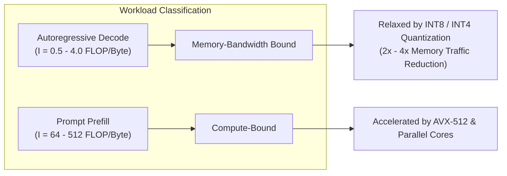

# CPU Inference Runtimes, Parallelism, and Performance Modelling Literature

**Project**: Architecture-Aware Optimization of an Offline Medical Question-Answering System  
**Research Focus**: Thread-Level Parallelism, Runtime Operator Scheduling, Memory Locality, and Roofline Performance Modelling  

---

## 1. CPU Inference Runtimes & Operator Execution

While Large Language Models are predominantly trained on massive GPU clusters, edge clinical deployments require high-efficiency **CPU-based inference** on host processors (e.g., AMD Zen 4 / Intel Core) due to strict power budgets, cost constraints, and air-gapped field hospital environments.

### Operator Parallelism & Thread Scheduling
Modern high-performance inference engines like **Intel OpenVINO** and **ONNX Runtime** leverage low-level vector extensions (AVX-512, AVX2, FMA3, VNNI) to accelerate dense matrix-matrix ($GEMM$) and matrix-vector ($GEMV$) operations:
1. **Thread Pooling**: Worker threads are initialized once and maintained in a persistent thread pool to eliminate operating system thread-creation overhead.
2. **Dynamic Work-Stealing vs. Static Partitioning**: Inner loops of tensor contractions partition rows across worker threads (`INFERENCE_NUM_THREADS`).
3. **CPU Affinity & Thread Pinning (`ENABLE_CPU_PINNING`)**:
   - Operating system schedulers frequently migrate worker threads across logical cores to balance thermal dissipation. This thread bouncing causes catastrophic **L1/L2 cache invalidation** and cross-CCX inter-core communication stalls.
   - Explicit thread pinning binds worker threads to specific physical CPU cores, preserving cache locality and stabilizing inference latency.

---

## 2. Thread-Level Parallelism & Scaling Dynamics

### Speedup & Parallel Efficiency
Let $T(1)$ denote single-thread execution latency, and $T(N)$ denote execution latency with $N$ worker threads:

$$\text{Speedup } S(N) = \frac{T(1)}{T(N)}$$

$$\text{Parallel Efficiency } E(N) = \frac{S(N)}{N} \times 100\%$$

### Amdahl's Law and Diminishing Returns
Amdahl's Law governs parallel speedup as a function of the parallel fraction $p$:

$$S(N) = \frac{1}{(1 - p) + \frac{p}{N}}$$

In autoregressive generative LLMs, several runtime factors prevent ideal linear scaling ($E < 100\%$):
1. **Sequential Autoregressive Dependency**: Token $t+1$ depends strictly on token $t$. Inter-token generation cannot be parallelized across time; parallelism is confined strictly within individual tensor operations.
2. **Memory Bus Saturation**: In memory-bound decode phases, adding more execution threads beyond memory channel saturation (e.g., $N > 8$ threads on dual-channel DDR5) creates memory controller contention without increasing throughput.
3. **Simultaneous Multithreading (SMT) Penalty**: Logical hyperthreads (threads 9–16 on an 8-core CPU) share physical L1/L2 caches and execution pipelines, often yielding sub-linear gains or resource contention compared to true physical cores.

---

## 3. Performance Modelling & The Roofline Framework

### Operational Arithmetic Intensity
Operational intensity ($I$) measures the ratio of algorithmic work to memory traffic:

$$I = \frac{\text{Total Operations (FLOPs)}}{\text{Total DRAM Traffic (Bytes)}}$$

In Transformer architectures:
- **Prefill (Compute-Bound)**: Full prompt sequences are processed as $GEMM$ ($I \approx 64 \dots 512\text{ FLOP/Byte}$). Arithmetic intensity scales linearly with prompt length $S$.
- **Decode (Memory-Bound)**: Generating one token requires loading all model weights $W$ from memory ($I \approx 0.5 \dots 4.0\text{ FLOP/Byte}$ for batch size 1).

### Roofline Interpretation for CPU Edge Inference
The Roofline model bounds attainable throughput by two distinct ceilings:
- **Memory Bandwidth Ceiling**: $P \le \beta_{\text{peak}} \times I$ (slanted boundary)
- **Compute Throughput Ceiling**: $P \le P_{\text{peak}}$ (horizontal boundary)

---

## 4. Connection to This Project

This research project directly bridges runtime systems theory with offline clinical AI:
1. **Architectural Grounding**: Evaluates the interaction between CPU microarchitecture (AMD Zen 4 AVX-512), memory hierarchy, thread allocation ($1 \dots 16$), and thread pinning.
2. **Precision vs. Bandwidth Optimization**: Demonstrates that INT4 and INT8 weight compression directly relax the memory bandwidth bottleneck during autoregressive clinical dialogue generation.
3. **Multi-Objective Trade-Offs**: Computes empirical Pareto frontiers across latency, memory footprint, and clinical question-answering accuracy.
