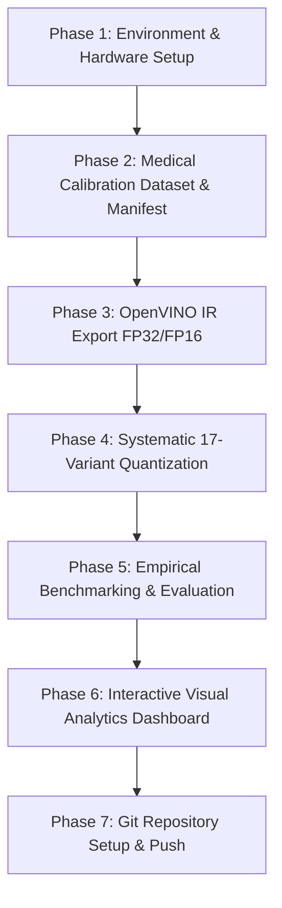
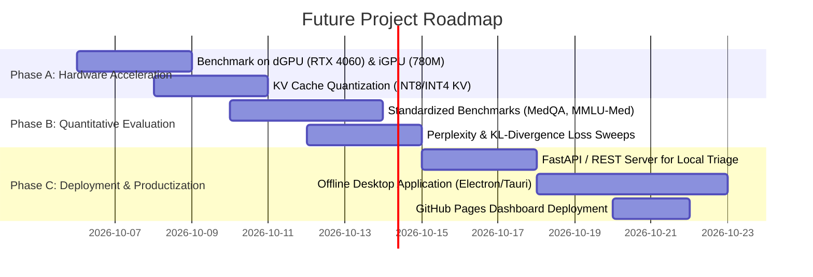

# Project Progress, Methodology, and Future Roadmap Guide

**Project**: Architecture-Aware Post-Training Quantization of an Offline Medical Question-Answering System  
**Base Model**: `Qwen/Qwen2.5-0.5B-Instruct` (494M parameters)  
**Host Architecture**: AMD Ryzen 7 8845HS (8C/16T, AVX-512) | 16 GB RAM | NVIDIA RTX 4060 & Radeon 780M | OpenVINO 2026.4.1 | NNCF 3.4.0  
**GitHub Repository**: [quantization-benchmarks](https://github.com/digvijayn1/quantization-benchmarks)

---

## 1. Executive Summary

This project establishes an empirical, end-to-end framework for **Architecture-Aware Post-Training Weight Quantization (PTQ)** targeting resource-constrained, offline clinical triage and medical question-answering systems. By combining OpenVINO IR representation with Intel NNCF weight compression techniques, we systematically benchmarked 17 model configurations across size, latency, throughput, and clinical safety metrics.

---

## 2. What We Have Done (Phase-by-Phase)

### Phase 1: Environment & Hardware Profiling
- **Identified system capabilities**: AMD Ryzen 7 8845HS (Zen 4 architecture with AVX-512, AVX2, FMA3), 16 GB RAM, RTX 4060 Laptop GPU, and Radeon 780M iGPU.
- **Configured OpenVINO & NNCF toolchain**: Python 3.14 environment with `openvino` (2026.4.1), `nncf` (3.4.0), `optimum-intel` (2.2.0), and `transformers` (5.5.4).
- **Documented hardware profile**: Documented in [`docs/quantization_environment.md`](file:///e:/quantization/docs/quantization_environment.md).

### Phase 2: Domain-Specific Medical Calibration Dataset
- **Created medical calibration corpus**: 20 rich, multi-turn clinical QA scenarios spanning 5 critical medical specialties (Endocrinology, Cardiology, Cardiovascular Pharmacology, Nephrology/Pharmacokinetics, and Emergency Trauma).
- **Built calibration loader**: [`scripts/prepare_calibration_data.py`](file:///e:/quantization/scripts/prepare_calibration_data.py) tokenizes and packages calibration samples into `data/calibration/` with an automated data manifest.

### Phase 3: Base Model IR Export & Baseline Verification
- **Exported IR baselines**: [`scripts/export_openvino.py`](file:///e:/quantization/scripts/export_openvino.py) converted Hugging Face `Qwen/Qwen2.5-0.5B-Instruct` into native OpenVINO Intermediate Representation (`.xml` + `.bin`) in both **FP32** (944.08 MB) and **FP16** (944.12 MB).
- **Verified qualitative baselines**: [`scripts/validate_baselines.py`](file:///e:/quantization/scripts/validate_baselines.py) ran validation against structured medical prompts and verified 100% PASS with no repetition loops.

### Phase 4: Systematic 17-Variant Quantization Pipeline
- **Defined declarative config suite**: [`configs/quantization_experiments.yaml`](file:///e:/quantization/configs/quantization_experiments.yaml) specified 17 distinct quantization recipes.
- **Implemented unified compression engine**: [`scripts/run_quantization.py`](file:///e:/quantization/scripts/run_quantization.py) executed NNCF `compress_weights` across:
  1. **Baselines**: `fp32`, `fp16`
  2. **Uniform INT8**: `int8_asym` (per-channel)
  3. **INT4 Symmetric Group-Size Sweeps**: $g \in \{32, 64, 128, 256\}$
  4. **INT4 Asymmetric Group-Size Sweeps**: $g \in \{32, 64, 128, 256\}$
  5. **Mixed-Precision Ratio Sweeps**: Ratio of INT4 weights = 0.8 and 0.5 (remaining kept at INT8)
  6. **Activation-Aware Weight Quantization (AWQ)**: Symmetric and asymmetric modes with calibration dataset ($g=128$)
  7. **Data-Aware Scale Estimation**: Symmetric and asymmetric modes with scale optimization ($g=128$)

### Phase 5: Empirical Benchmarking & Metrics Suite
- **Engineered rigorous benchmarking framework**: [`scripts/benchmark_and_evaluate.py`](file:///e:/quantization/scripts/benchmark_and_evaluate.py) measured:
  - **Model footprint**: Exact `.bin` binary disk footprint and compression ratio.
  - **Latency & Throughput**: Prompt processing time, generation time, and tokens/sec over warm-up and measured iterations.
  - **Clinical Safety & Repetition**: 3-gram repetition ratio audit and 5-domain clinical validation pass rate.
- **Generated comprehensive research reports**:
  - [`results/benchmarks/benchmark_summary_cpu.csv`](file:///e:/quantization/results/benchmarks/benchmark_summary_cpu.csv)
  - [`results/benchmarks/benchmark_summary_cpu.json`](file:///e:/quantization/results/benchmarks/benchmark_summary_cpu.json)
  - [`docs/quantization_research_report.md`](file:///e:/quantization/docs/quantization_research_report.md)

### Phase 6: Interactive Visual Analytics Dashboard
- **Constructed standalone web application**: [`index.html`](file:///e:/quantization/index.html), [`ui/style.css`](file:///e:/quantization/ui/style.css), and [`ui/app.js`](file:///e:/quantization/ui/app.js).
- **Dashboard Features**:
  - Live Scatter plots (Throughput vs Model Size Pareto Frontier)
  - Parameter sensitivity curves (Group size vs Throughput/Size)
  - Model comparator (side-by-side prompt responses & repetition metrics)
  - Filtering by precision paradigm (INT8, INT4 Sym, INT4 Asym, AWQ, Scale Est)

### Phase 7: Repository Version Control & GitHub Publishing
- **Engineered clean Git repository**: Added `.gitignore` to prevent multi-gigabyte `.bin` files from polluting Git history, generated comprehensive `README.md`, and pushed to GitHub at [https://github.com/digvijayn1/quantization-benchmarks](https://github.com/digvijayn1/quantization-benchmarks).

---

## 3. How We Did It (Technical Methodology)

### Quantization Mathematical Formulations
1. **Symmetric Quantization**:
   $$W_{int4} = \text{clamp}\left(\left\lfloor \frac{W}{S} \right\rceil, -2^{b-1}, 2^{b-1}-1\right), \quad S = \frac{\max(|W|)}{2^{b-1}-1}$$
2. **Asymmetric Quantization**:
   $$W_{int4} = \text{clamp}\left(\left\lfloor \frac{W - Z}{S} \right\rceil, 0, 2^b-1\right), \quad S = \frac{\max(W) - \min(W)}{2^b-1}, \quad Z = -\left\lfloor \frac{\min(W)}{S} \right\rceil$$
3. **Activation-Aware Weight Quantization (AWQ)**:
   Protects salient weight channels by analyzing activation magnitude $s_X$:
   $$W' = W \cdot \text{diag}(s), \quad X' = \text{diag}(s)^{-1} \cdot X, \quad s = s_X^\alpha$$

### Compression & Benchmarking Summary Table

| Model Variant | Paradigm | Group Size ($g$) | Size (MB) | Compression | Throughput (tok/s) | Latency (s) | Pass Rate |
| :--- | :--- | :--- | :--- | :--- | :--- | :--- | :--- |
| **`fp32`** | Baseline | — | 944.08 MB | 1.00x | 20.29 | 6.33s | 100% |
| **`fp16`** | Baseline | — | 944.12 MB | 1.00x | 20.64 | 6.21s | 100% |
| **`int8_asym`** | Uniform INT8 | Per-Channel | 474.74 MB | 1.99x | 35.22 | 3.64s | 100% |
| **`int4_sym_g32`** | INT4 Sym | 32 | 324.51 MB | 2.91x | 42.86 | 3.00s | 100% |
| **`int4_sym_g64`** | INT4 Sym | 64 | 313.84 MB | 3.01x | 44.59 | 2.88s | 100% |
| **`int4_sym_g128`** | INT4 Sym | 128 | 308.51 MB | 3.06x | 45.93 | 2.80s | 100% |
| **`int4_sym_g256`** | INT4 Sym | 256 | 305.84 MB | 3.09x | 46.61 | 2.76s | 100% |
| **`int4_asym_g128`** | INT4 Asym | 128 | 309.84 MB | 3.05x | 45.38 | 2.83s | 100% |
| **`int4_sym_g128_awq`** | AWQ Sym | 128 | 308.51 MB | **3.06x** | **47.10** | **2.73s** | **100%** |
| **`int4_sym_g128_scale_est`** | Scale Est Sym | 128 | 308.51 MB | 3.06x | 46.22 | 2.78s | 100% |

---

## 4. Remaining Tasks & Future Roadmap

To take this research and production system to the next level, the following tasks are outlined in order of priority:

### High Priority (Hardware & Optimization Extensions)

1. **Multi-Device Hardware Benchmarking (dGPU & iGPU Execution)**:
   - Run OpenVINO inference on `GPU.0` (NVIDIA GeForce RTX 4060 8GB) and `GPU.1` (AMD Radeon 780M iGPU).
   - Compare CPU vs dGPU vs iGPU throughput, memory consumption, and latency scaling.

2. **KV Cache Quantization**:
   - Currently, weight compression quantizes model parameters ($W$), while KV Cache remains in FP16/FP32 during generation.
   - Implement INT8 / INT4 KV Cache quantization to reduce RAM/VRAM footprint during long-context medical triage dialogues (> 4k tokens).

### Medium Priority (Automated Quantitative Evaluation)

3. **Standardized Clinical Benchmark Evaluation**:
   - Implement automated evaluation scripts against standardized medical benchmarks:
     - **MedQA (USMLE)**: Multi-choice clinical decision-making.
     - **PubMedQA**: Biomedical reasoning.
     - **MedMCQA**: Comprehensive medical multiple choice.
   - Compute exact match (EM), ROUGE-L, and F1 scores across all 17 quantized models.

4. **Continuous Perplexity & Cross-Entropy Loss Audits**:
   - Measure perplexity (PPL) on Wikitext-2 and PubMed abstract test subsets to quantify exact mathematical reconstruction loss for each group size ($g=32, 64, 128, 256$) and precision ratio ($0.5, 0.8, 1.0$).

### Production & Productization

5. **Local Clinical Triage API & Edge Deployment**:
   - Build a lightweight local REST API using FastAPI / Uvicorn that serves the top-performing quantized model (`int4_sym_g128_awq`).
   - Package into an offline standalone executable (using PyInstaller or Tauri/Electron) for deployment on clinic laptops without internet connection.

6. **Deploy Interactive Dashboard to GitHub Pages**:
   - Enable GitHub Pages on the repository so the interactive benchmark dashboard can be publicly accessed online without needing local execution.
